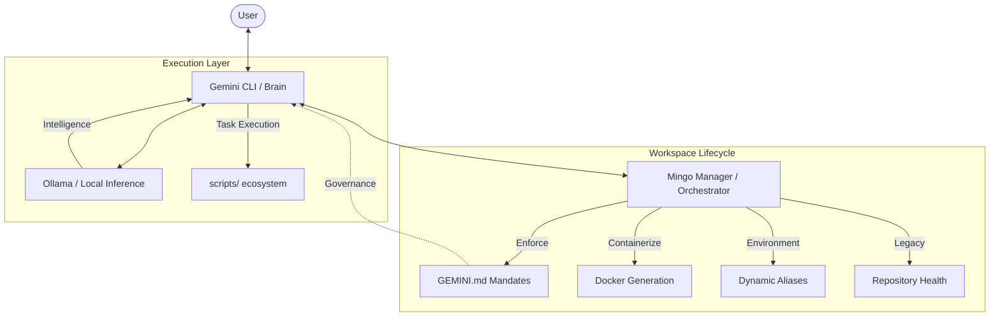

# Mingo System

> **"Personal-First, Public-Ready: A developer's laboratory for evolving ideas into production-grade systems."**

Mingo System is not just a toolset; it is a **Polyglot Orchestration Framework** designed to manage personal projects with the rigor of a professional ecosystem. It provides the infrastructure to experiment rapidly across different languages and domains, ensuring that any successful module can be easily decoupled and published as a standalone container or repository.

## The Philosophy

The core of Mingo System is built on three pillars:

1.  **Modular Evolution:** Start as a private script, evolve into a system module, and finally decouple into a distributed service (Docker/Kubernetes).
2.  **Polyglot Harmony:** Seamlessly integrate TypeScript (CLI), Python (Manager/Automation), and Go (Inference) without cross-contamination.
3.  **AI-First Developer Experience:** Leveraging LLMs not just for code generation, but as active orchestrators of the development lifecycle.

## Systemic Administration

Mingo System manages complexity through a tiered orchestration model. Instead of focusing merely on *where* files are, we focus on *how* they interact and deploy:

## Governance & Scaling

Development in this system follows a structured path:
- **Research:** Exploratory scripts and ideas.
- **Integration:** Formalizing the idea into `src/` following the [GEMINI.md](./GEMINI.md) mandates.
- **Orchestration:** Adding CLI commands or protocol automations to manage the new feature via `./mingo`.
- **Dockerization:** Using `my-manager` to generate Dockerfiles and prepare the module for containerized deployment.

## Navigation

- **[GEMINI.md](./GEMINI.md):** The "Source of Truth" for architectural mandates, coding standards, and project policies.
- **[docs/GETTING_STARTED.md](./docs/GETTING_STARTED.md):** Technical instructions for bootstrapping, starting services, and environment setup.
- **[src/](./src/):** The core modules of the system (AI Orchestrator, Manager, and Inference Engine).

---
*Mingo System: Orchestrating the future of personal engineering.*
